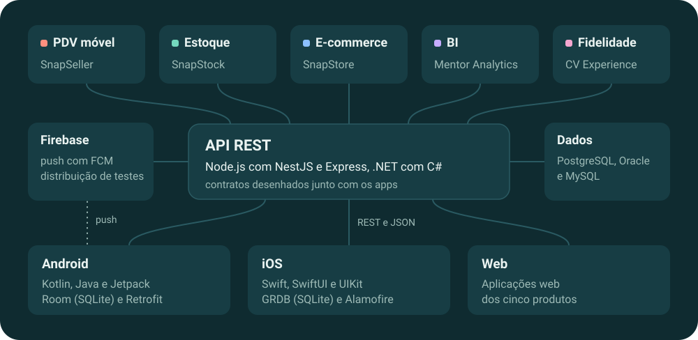
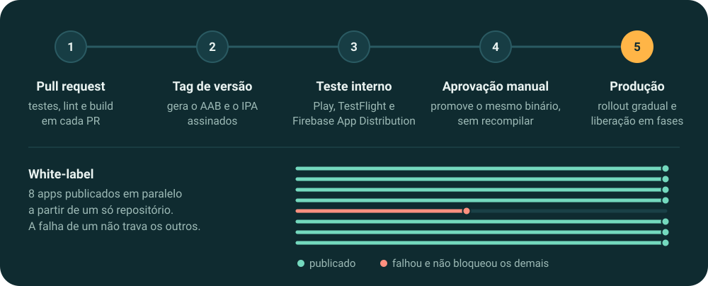
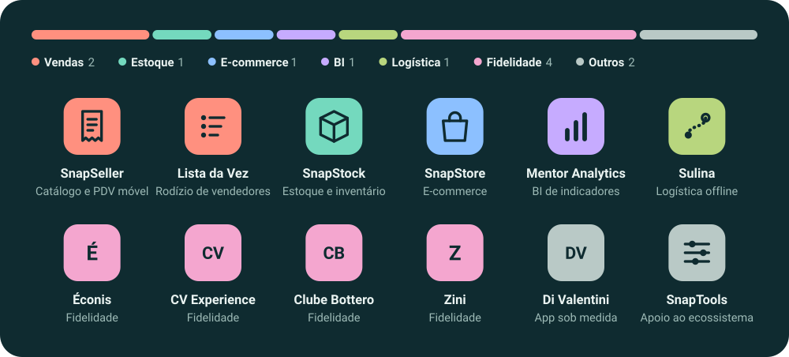
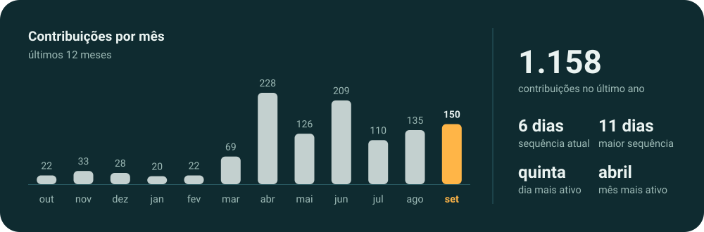

Há 6 anos construo produtos de ponta a ponta no [@grupo-w2abrasil](https://github.com/grupo-w2abrasil): as APIs, os apps Android e iOS que as consomem e a esteira que publica tudo nas lojas. Esse código vive em repositórios privados, então este perfil mostra o que ele sustenta.

### Um back-end, cinco produtos, três plataformas

### Do pull request à loja

### 12 apps em produção

Abrir os apps na loja

- [SnapSeller](https://play.google.com/store/apps/details?id=COLE_O_ID_AQUI): catálogo de vendas e PDV móvel
- [Lista da Vez](https://play.google.com/store/apps/details?id=COLE_O_ID_AQUI): rodízio inteligente de vendedores
- [SnapStock](https://play.google.com/store/apps/details?id=COLE_O_ID_AQUI): gestão de estoque, inventário e conferências
- [SnapStore](https://play.google.com/store/apps/details?id=COLE_O_ID_AQUI): e-commerce, sua loja na palma da mão
- [Mentor Analytics](https://play.google.com/store/apps/details?id=COLE_O_ID_AQUI): BI de indicadores e métricas
- [Sulina](https://play.google.com/store/apps/details?id=COLE_O_ID_AQUI): logística de rotas entre transportadoras e motoristas, 100% offline
- [Éconis](https://play.google.com/store/apps/details?id=COLE_O_ID_AQUI), [CV Experience](https://play.google.com/store/apps/details?id=COLE_O_ID_AQUI), [Clube Bottero](https://play.google.com/store/apps/details?id=COLE_O_ID_AQUI) e [Zini](https://play.google.com/store/apps/details?id=COLE_O_ID_AQUI): programas de fidelidade
- [Di Valentini](https://play.google.com/store/apps/details?id=COLE_O_ID_AQUI): app sob medida para clientes, com acompanhamento de compras e vantagens
- [SnapTools](https://play.google.com/store/apps/details?id=COLE_O_ID_AQUI): auxiliares do ecossistema Snapcontrol

### Atividade

O gráfico é redesenhado todo dia por uma GitHub Action deste repositório.

 

Bacharel em Engenharia de Software pela Estácio (2025). Português nativo, inglês avançado em leitura e escrita técnica.
